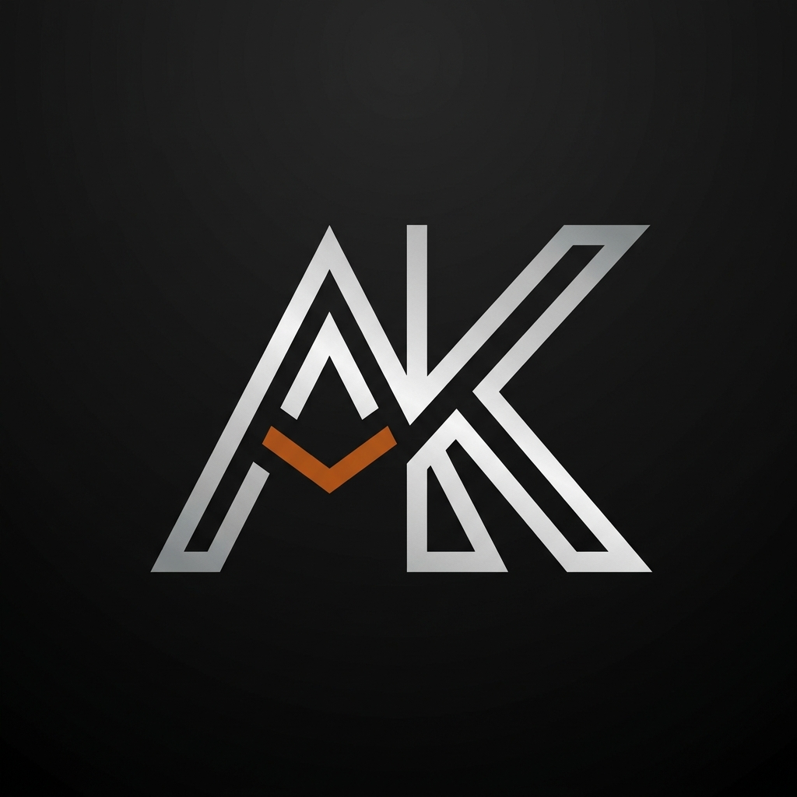

# AuraKeys | Luxury Bespoke Mechanical Keyboards



AuraKeys is a premium, headless e-commerce storefront designed for bespoke, CNC-machined mechanical keyboards. Built to deliver an immersive, stutter-free shopping experience with high-end aesthetics, cinematic animations, and real-time interactive 3D elements.

## Tech Stack

- **Framework**: Next.js 15 (App Router)
- **Styling**: Tailwind CSS
- **Commerce**: Shopify Storefront API (Headless)
- **State Management**: Zustand
- **Animations**: Framer Motion
- **3D Graphics**: Three.js & React Three Fiber (R3F)
- **Audio Engine**: Web Audio API (Hardware-accelerated Convolution Reverb)

## Features

- **Shopify Headless Integration**: Secure, server-side fetching of products, variants, and dynamic pricing with a fallback local dataset for seamless demo deployments without API keys.
- **Interactive 3D Customizer**: A fully interactive WebGL canvas allowing users to inspect keyboard chassis, keycaps, and switches from any angle.
- **Acoustic Profiling**: A bespoke DSP Audio Engine that realistically simulates the tactile, acoustic "thock" of premium mechanical keyboards based on switch type and chassis density.
- **Cinematic Performance**: Carefully optimized rendering loops and viewport-triggered animations (Framer Motion) ensuring silky 60FPS on both desktop and mobile.
- **Programmatic SEO**: Automatically generated sitemaps and crawler directives.
- **Luxury UI/UX**: Custom typography, glassmorphism, floating navigational elements, and an interactive drawer-based cart system.

## Getting Started

### 1. Install Dependencies
```bash
npm install
```

### 2. Configure Environment (Optional for Live Data)
Create a `.env.local` file and add your Shopify credentials to connect to a live store:
```env
SHOPIFY_STORE_DOMAIN=your-store.myshopify.com
SHOPIFY_STOREFRONT_ACCESS_TOKEN=your_token_here
```
*(Note: If no credentials are provided, the app securely falls back to a high-fidelity mock catalog, meaning it is instantly deployable as a portfolio piece!)*

### 3. Run Development Server
```bash
npm run dev
```
Open [http://localhost:3000](http://localhost:3000) to view the application.

## Deployment

AuraKeys is optimized for deployment on Vercel. 
1. Connect your GitHub repository to Vercel.
2. Vercel will automatically detect the Next.js framework.
3. Deploy!

---
*AURAKEYS LAB © 2026. ALL TELEMETRY LOGGED.*
